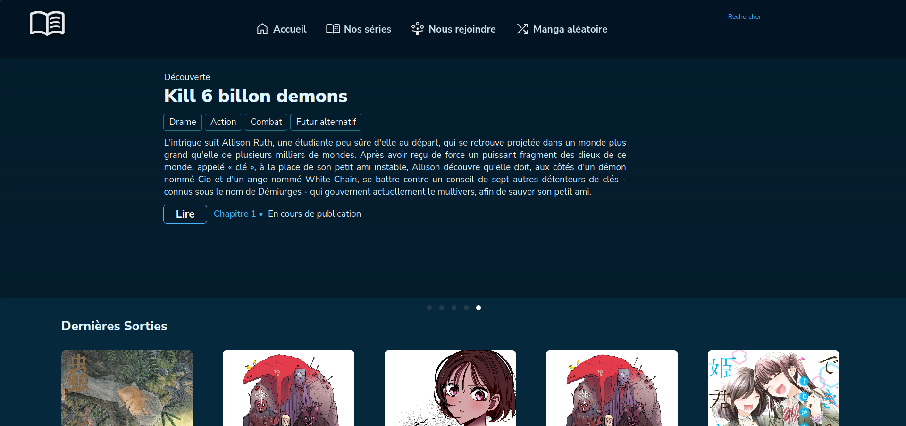
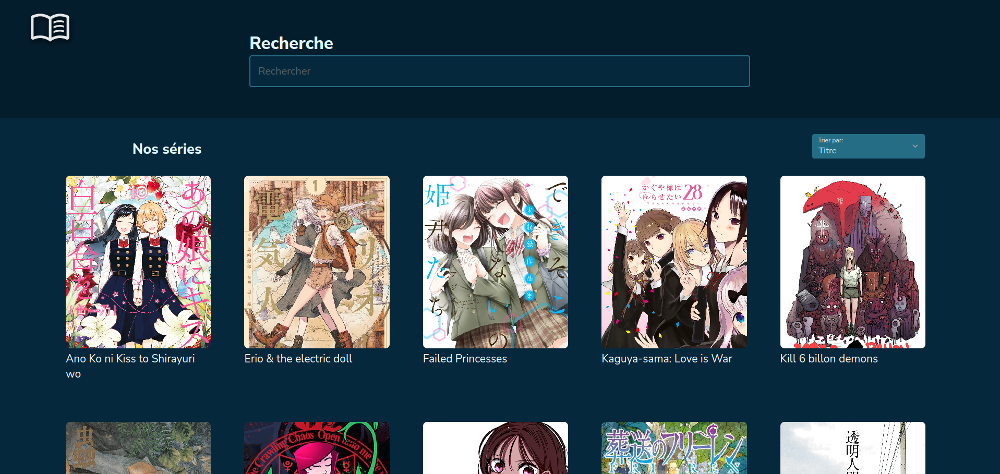
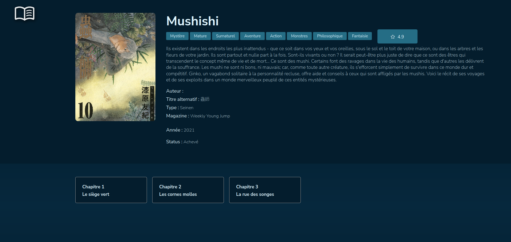
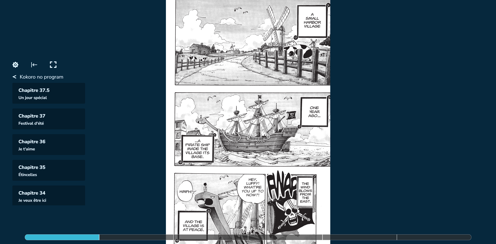

# MangaSite

# Overview

Ceci est un projet personnel conçu pour apprendre à manipuler React et Node.
Le choix de la technologie pour la base de données s'est porté sur MariaDB.
Ce projet a été réalisé avec un ami. Tandis qu'il s'est occupé back-end, je me suis concentré sur le front-end.

Ce projet consiste en la création d'un site web pour la lecture de mangas et s'inspire de [Catmanga](https://web.archive.org/web/20210430012045/http://catmanga.org/).

Visuals :

|  |
|:--:|
| *Page home* |

|  |
|:--:|
| *Liste de toute les series* |

|  |
|:--:|
| *Information d'un manga* |

|  |
|:--:|
| *Lecteur. Vous pouvez choisir les chapitre à gauche, naviger en appuyer de chaques cotés de l'image* |